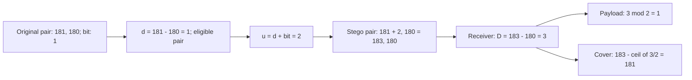
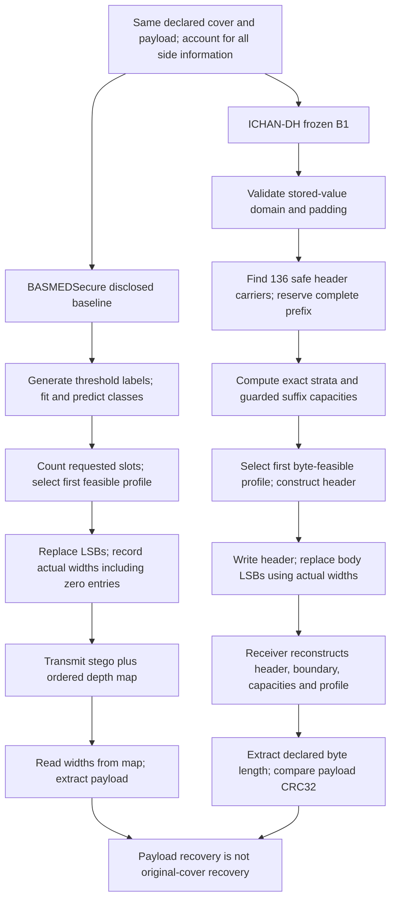

# Pixel-Level Comparison: Reference DE, BASMEDSecure, and ICHAN-DH

## 1. Purpose and evidence boundary

This document explains where the three methods differ, follows individual pixel calculations, and separates numerical costs from correctness claims. It supplements the presentation, not the frozen algorithm specification.

**Evidence label: analytical worked examples.** The values below are calculated for explicitly constructed arrays. They are not dataset measurements, executed notebook results, or evidence of clinical preservation. No research program was executed for this document.

The method in the supplied Fig. 6 is **not BASMEDSecure**. It is the difference-expansion and modulus method of Maniriho and Ahmad [1]. Its reversible pair transformation is useful for explaining why replacing low-order bits is a different operation.

| Question | Reference DE [1] | Disclosed BASMEDSecure baseline [2] | Frozen ICHAN-DH B1 [3] |
|---|---|---|---|
| Processing unit | A pair of pixels | One classified pixel | One stored-value pixel |
| Selection rule | Small signed pair difference and valid output range | Logistic-regression predicted class and selected profile | Exact stratum and safe aligned replacement block |
| Where is the bit stored? | Parity of expanded pair difference | Selected low-order bits | Selected low-order bits |
| Receiver side information | Tracing table (TRT) | Ordered actual-depth map | Shared domain/padding metadata and an embedded header |
| Original cover recovered? | Conditional pair recovery under the stated transformation and correct TRT | No, not from replacement alone | Explicitly not claimed |
| Main comparison objective | Explain a reversible alternative | Reproducible, disclosed baseline | Receiver-reconstructible payload recovery |

Read Sections 2, 4, and 6 first for a supervisor discussion. Equations use GitHub-supported fenced math blocks. Editable diagrams are in [assets](assets/).

## 2. Recalculate the supplied figure

### A. One pair, one bit

Use the original pair `(181, 180)` and secret bit `b = 1`. Rename the intermediate increment to `u` and the received difference to `D` to avoid confusing the figure's difference labels.

| Stage | Operation | Substitution | Meaning |
|---|---|---|---|
| 1 | Original difference | `d = 181 - 180 = 1` | The pair satisfies the small-difference condition |
| 2 | Intermediate increment | `u = d + b = 1 + 1 = 2` | This is not the final stego-pair difference |
| 3 | New first pixel | `z' = z + u = 181 + 2 = 183` | The second pixel remains 180 |
| 4 | Received difference | `D = 183 - 180 = 3` | Expansion produces `D = 2d + b` |
| 5 | Extract payload | `b = 3 mod 2 = 1` | Parity recovers the secret bit |
| 6 | Recover first pixel | `z = 183 - ceil(3/2) = 181` | Correct inverse recovers the cover pair |

These correspond to [1], Eqs. (1), (2), (3), (22), (23), and (24). The received difference is **3**, not the intermediate increment **2**.

```math
d=z-y,\qquad u=d+b,\qquad z'=z+u,\qquad y'=y.
```

Substituting gives the actual difference expansion:

```math
D=z'-y'=z+d+b-y=2d+b.
```

For an integer `d` and a bit `b`, Euclidean division gives:

```math
b=D\bmod 2,\qquad d=\left\lfloor D/2\right\rfloor,\qquad
z=y'+\left\lfloor D/2\right\rfloor
=z'-\left\lceil D/2\right\rceil.
```

This proves the pair-level inverse, assuming the reference pixel is unchanged, the pair is correctly identified as used, and the output has not been clipped or corrupted. Negative differences require mathematical floor/ceiling, not truncation toward zero. For `(138,140)` and bit 1: `d=-2`, `u=-1`, `z'=137`, `D=-3`; then `-3 mod 2=1` and `137-ceil(-3/2)=138`.

**Range counterexample:** `(255,254)` and bit 1 would produce 257. It must not be accepted as an 8-bit output. Clipping 257 to 255 destroys the inverse. Small difference alone is insufficient.

### B. What percentage changed?

For the original example, the first pixel changes by +2, while the second does not change:

| Quantity | Calculation | Result |
|---|---|---:|
| Relative change of the first positive value | `2/181 × 100` | 1.1050% |
| Change relative to the 8-bit declared range | `2/255 × 100` | 0.7843% |
| Fraction of pair pixels changed | `1/2 × 100` | 50% |
| Pair squared error | `2² + 0²` | 4 |
| Pair mean squared error | `4/2` | 2 |
| Embedded payload per pair pixel | `1/2` | 0.5 bit/pixel, before TRT cost |

These percentages have different denominators. None means “50% image quality loss” or “1.1050% less secure.”



Editable version: [01_reference_pair.mmd](assets/01_reference_pair.mmd).

### C. The complete matrix in the figure

Use horizontal, non-overlapping pairs in row-major order. This is an explicit convention for this illustration.

```text
181 180 112 100
138 140 132  67
192 193  99 200
167 116  89 120
120 118 171 171
 97  74 155 160
```

The six-bit caption message is `111110`, but the figure demonstrates only its first bit. Applying the small-difference rule to this matrix gives the following independent trace:

| Pair | Original values | Difference | Eligible for one bit? | Next bit, if available | First-pixel output |
|---:|---|---:|---|---|---:|
| 1 | 181, 180 | 1 | Yes | 1 | 183 |
| 2 | 112, 100 | 12 | No | Not consumed | 112 |
| 3 | 138, 140 | -2 | Yes | 1 | 137 |
| 4 | 132, 67 | 65 | No | Not consumed | 132 |
| 5 | 192, 193 | -1 | Yes | 1 | 192 |
| 6 | 99, 200 | -101 | No | Not consumed | 99 |
| 7 | 167, 116 | 51 | No | Not consumed | 167 |
| 8 | 89, 120 | -31 | No | Not consumed | 89 |
| 9 | 120, 118 | 2 | Yes | 1 | 123 |
| 10 | 171, 171 | 0 | Yes | 1 | 172 |
| 11 | 97, 74 | 23 | No | Not consumed | 97 |
| 12 | 155, 160 | -5 | No | Not consumed | 155 |

Only five pairs are eligible: `5/12 = 41.6667%`. Thus this particular one-pass pairing provides five bits, or `5/24 = 0.2083 bit/pixel`, before side information. The sixth bit does not fit. The table is a five-bit prefix illustration, **not a successful embedding of all six bits** and not evidence that the paper's full experiment is invalid. Notice that a pair can carry a bit even when its first pixel does not change, as in pair 5.

ICHAN-DH cannot embed a complete packet into this 24-pixel matrix: it requires 136 header carriers before any body capacity is considered. A body-only illustration must not be presented as a complete B1 execution.

## 3. Common notation and valid percentage measures

Let `X` be the original array, `Y` the stego array, and `N` their pixel count. Let `R` be the declared stored-value range width: 255 for unsigned 8-bit values, 4095 for 12-bit values. It is not the observed maximum minus minimum of a particular image.

```math
\Delta_i=Y_i-X_i,\qquad
\mathrm{SSE}=\sum_{i=0}^{N-1}\Delta_i^2,\qquad
\mathrm{MSE}=\mathrm{SSE}/N.
```

```math
\mathrm{ChangedPixels}(\%)=
100\frac{\#\{i:Y_i\ne X_i\}}{N},\qquad
\mathrm{RangeChange}_i(\%)=100\frac{|\Delta_i|}{R}.
```

```math
\mathrm{PSNR}=10\log_{10}\left(\frac{R^2}{\mathrm{MSE}}\right),\qquad
\mathrm{RelativeChange}(\%)=100\frac{\mathrm{new}-\mathrm{old}}{\mathrm{old}}.
```

The last expression is used here only for meaningful positive baselines and comparable units. PSNR differences are reported in dB, not as a percentage improvement. At zero MSE, PSNR is infinite. A separate pixel-relative magnitude, `100|Delta_i|/|X_i|`, is undefined at zero and potentially misleading for signed stored values; prefer range-normalized changes. No percentage can be assigned to an equation merely because it is new.

## 4. BASMEDSecure versus ICHAN-DH, equation by equation

### A. Input domain and classification: B1.1 and B1.2

The baseline derives training labels from 8-bit thresholds, then fits a classifier. ICHAN-DH evaluates the partition directly on native stored values:

```math
d_{\min}=-s2^{b-1},\qquad R=2^b-1,\qquad z(x)=x-d_{\min}.
```

```math
g(x)=\begin{cases}
0,&255z(x)\le100R,\\
1,&100R<255z(x)\le150R,\\
2,&150R<255z(x).
\end{cases}
```

For unsigned 8-bit data this is exactly `0..100`, `101..150`, and `151..255`. The normalized cut points are `100/255 = 39.2157%` and `150/255 = 58.8235%` of the domain width. These are normalized stored-code partition positions, not diagnostic thresholds or accuracy scores.

For unsigned 12-bit values, the upper integer cutoffs are 1605 and 2408. For signed 12-bit values, subtract 2048: the upper cutoffs become -443 and 360. No conversion to an 8-bit display image is required. For example, signed `x=-443` has `z=1605` and belongs to stratum 0.

**Effect:** classification becomes deterministic and independent of model fitting. This is a structural correction, not a measured percentage increase in accuracy or speed. All baseline examples below explicitly assume its predicted labels match its threshold-generated training labels; that assumption is not a verified training result.

### B. Requested depths and safe blocks: B1.3 and B1.5

Both methods use ordered profiles:

```math
D_1=(1,0,0),\qquad D_2=(2,1,0),\qquad D_3=(3,2,1).
```

The baseline uses the requested depth from the predicted class. ICHAN-DH reduces it when any possible replacement would cross a stratum or touch declared padding. For candidate depth `r`, the aligned block is:

```math
\ell_r(x)=d_{\min}+2^r\left\lfloor z(x)/2^r\right\rfloor,
\qquad \mathcal B_r(x)=\{\ell_r(x),\ldots,\ell_r(x)+2^r-1\}.
```

The guarded depth is the largest candidate up to the requested depth whose complete block lies in one stratum and avoids the padding set. If no positive candidate works, use zero. This is a largest-safe-depth rule, not simply “skip every unsafe requested block.”

For profile 3, unsigned 8-bit values, and no padding:

| Pixel | Stratum | Baseline requested depth | Guard checks, largest first | B1 depth | Slot reduction |
|---:|---:|---:|---|---:|---:|
| 100 | 0 | 3 | `[96,103]`, `[100,103]`, `[100,101]` all cross 100/101 | 0 | 100% |
| 99 | 0 | 3 | `[96,103]` fails; `[96,99]` passes | 2 | 33.3333% |
| 150 | 1 | 2 | `[148,151]` and `[150,151]` cross 150/151 | 0 | 100% |
| 148 | 1 | 2 | `[148,151]` fails; `[148,149]` passes | 1 | 50% |
| 98 | 0 | 3 | `[96,103]` fails; `[96,99]` passes | 2 | 33.3333% |
| 152 | 2 | 1 | `[152,153]` passes | 1 | 0% |
| 180 | 2 | 1 | `[180,181]` passes | 1 | 0% |
| 181 | 2 | 1 | `[180,181]` passes | 1 | 0% |

Total requested slots: 16. Total guarded slots: 8. **The local capacity reduction is 50% for this suffix and this profile.** It is not an estimated dataset-wide loss.

Why is the guard needed? At `x=100`, a one-bit write of 1 would produce 101. A receiver that simply reclassifies 101 obtains a different stratum and can select a different depth. BASMEDSecure avoids this specific dependency by relying on its transmitted depth map. ICHAN-DH removes that map, so it must preserve the decisions the receiver will reconstruct.

Padding is a separate condition. If declared padding is `{0}`, then pixel 1 cannot use even one bit, because its block `[0,1]` includes padding. Checking only whether the original pixel equals padding would miss this case.

### C. Header carriers: B1.4

ICHAN-DH selects the first 136 positions whose one-bit blocks avoid padding. These positions carry a fixed 17-byte header. If the last selected index is `j135`, the entire prefix through that index is reserved, and the body begins at `beta = j135 + 1`.

With no padding, `beta=136`. With padding, the prefix may be longer. Header eligibility does **not** require stratum preservation; body eligibility does. Conflating these rules would change the frozen method.

**Effect:** the fixed-format header and invariant, receiver-reconstructible body schedule remove the external depth map, at the cost of header carriers and reserved-prefix capacity. These costs must be included in full-array distortion and capacity accounting.

### D. Capacity and profile choice: B1.6 and B1.7

```math
C_p^{\mathrm{raw}}=\sum_{i=\beta}^{N-1}h_p(X_i),\qquad
L_p^{\max}=\left\lfloor C_p^{\mathrm{raw}}/8\right\rfloor.
```

```math
p^*=\min\{p\in\{1,2,3\}:L\le L_p^{\max}\}.
```

Here `h` is the guarded depth and `L` is payload length in bytes. The baseline counts requested bits over its cover. B1 counts guarded bits only in the body suffix and admits complete bytes. For capacities `(2,5,8)` bits and a one-byte payload, B1 must select profile 3, even though profiles 1 and 2 have nonzero raw capacity.

Tail loss is `C_raw mod 8`: for seven raw slots, all seven are unusable for a byte payload; for nine slots, one is unused, or `1/9 = 11.1111%`. This is byte-framing loss, distinct from guard loss and prefix reservation.

### E. Header fields and CRC: B1.8

The header is `ICHS | version | uint64be(length) | uint32be(CRC32(payload))`: `4 + 1 + 8 + 4 = 17` bytes. Length supplies the exact payload endpoint. CRC32 detects checksum mismatches for the payload body, conditional on a parsable header.

CRC32 is not encryption, authentication, or proof of an unmodified header. A universal “99.99999998% secure” claim from its 32-bit width would be invalid. No security percentage is reported here.

### F. Pixel replacement: B1.9

For `m` actual bits represented by integer `v`:

```math
E_m(x,v)=d_{\min}+2^m\left\lfloor z(x)/2^m\right\rfloor+v,
\qquad 0\le v<2^m.
```

For unsigned values this is ordinary LSB replacement. The essential new element is the **safe, reconstructible schedule**, not a new arithmetic replacement operator.

Example: `x=99`, `m=2`, chunk `10` means `v=2`:

```math
E_2(99,2)=4\lfloor99/4\rfloor+2=96+2=98.
```

Binary: `01100011 -> 01100010`; extraction returns `98 mod 4 = 2 = binary 10`. The change is -1, or `1/255 × 100 = 0.3922%` of the declared range. Although two bits are carried, only one bit position and one stored-value unit change.

The general distortion bound is `|E_m(x,v)-x| <= 2^m-1`. For widths 1, 2, and 3, the bounds are 1, 3, and 7 stored-value units, respectively: 0.3922%, 1.1765%, and 2.7451% of an 8-bit range. These are worst-case bounds, not expected distortions. Reducing width from 3 to 2 reduces this bound by `4/7 = 57.1429%`, but does not guarantee a 57.1429% reduction in measured MSE.

If only two payload bits remain at a pixel with depth 3, use actual width `m=2`. For `x=96` and final chunk `10`, output is 98, not a three-bit write padded with an invented extra bit. The receiver reconstructs the same remaining length.

### G. Extraction and proof: B1.10

The local identity is:

```math
(E_m(x,v)-d_{\min})\bmod2^m=v.
```

For a guarded body write, the output stays inside the accepted aligned block. It preserves stratum and padding membership. Larger candidate blocks are unchanged, while smaller containing blocks remain safe subsets. Therefore every profile's guarded depth is unchanged. Header carrier positions and the body boundary also remain unchanged. The receiver consequently reconstructs the same capacities, profile, actual widths, and endpoint, and the remainder identity recovers the payload.

This establishes conditional payload recovery for intact arrays and identical protocol metadata, not empirical robustness. It does not recover the cover: with width 1 and bit 1, both 180 and 181 map to 181. The inverse cannot choose the original value without additional information.

## 5. Aligned program flow



All input, capacity, and parsing failures must reject rather than silently produce partial success. The diagram summarizes the successful path; use the [normative specification](../ichansecure/assets/reference/mathematical_specification.md) for all rejection conditions.

Editable version: [02_basmed_vs_ichan.mmd](assets/02_basmed_vs_ichan.mmd).

## 6. Complete one-byte worked example

Editable calculation flowchart: [03_pixel_walkthrough.mmd](assets/03_pixel_walkthrough.mmd). In draw.io, insert the Mermaid source through its Mermaid insertion dialog. The first two diagrams above also render directly in GitHub.

### A. One common input

Construct a 12 by 12 array, flattened row-major, with unsigned 8-bit values and **no declared padding**:

```text
X = [136 zeros] || [100, 99, 150, 148, 98, 152, 180, 181]
Payload = hexadecimal A6 = binary 10100110
```

This is an abstract-array example, not a valid CT DICOM fixture or a representative medical image. Zero is usable here only because the declared padding set is empty.

### B. Baseline embedding and extraction

Under the stated predicted-label assumption, the class counts are `(139,2,3)`. Requested capacities are:

```math
C_1=139,\qquad C_2=2(139)+2=280,\qquad
C_3=3(139)+2(2)+3=424.
```

The eight-bit payload fits profile 1. The first eight zeros carry one bit each:

| Index | Original | Payload bit | Stego | Squared error |
|---:|---:|---:|---:|---:|
| 0 | 0 | 1 | 1 | 1 |
| 1 | 0 | 0 | 0 | 0 |
| 2 | 0 | 1 | 1 | 1 |
| 3 | 0 | 0 | 0 | 0 |
| 4 | 0 | 0 | 0 | 0 |
| 5 | 0 | 1 | 1 | 1 |
| 6 | 0 | 1 | 1 | 1 |
| 7 | 0 | 0 | 0 | 0 |

All remaining pixels are unchanged. The external visited-position depth map is eight entries of 1. With a simple fixed two-bit encoding for depth symbols 0 through 3, its entries occupy 16 bits, excluding map framing and transport. This is one explicit encoding model, not a claim about Python object memory or optimal compression. Reading each stego value modulo 2 recovers `10100110`.

### C. ICHAN-DH header and profile

The first 136 pixels are safe header carriers; the suffix starts at index 136. The guarded depth vectors are:

| Profile | Depths for the eight suffix pixels | Raw bits | Whole payload bytes |
|---|---|---:|---:|
| 1 | `0,1,0,0,1,0,0,0` | 2 | 0 |
| 2 | `0,2,0,1,2,0,0,0` | 5 | 0 |
| 3 | `0,2,0,1,2,1,1,1` | 8 | 1 |

Profile 3 is therefore selected. CRC-32/ISO-HDLC for the one-byte payload `A6` is `EDB7E950`. The exact header bytes are:

```text
49 43 48 53 | 01 | 00 00 00 00 00 00 00 01 | ED B7 E9 50
magic      | ver| length = 1              | CRC32
```

This analytical checksum value is not a substitute for later package verification. The header has 33 one-bits. Since its original carriers are all zero, 33 header pixels become 1 and header SSE is 33. Its other 103 carriers remain zero.

### D. Every suffix pixel

| Index | Original | Requested depth, p3 | Safe depth | Consumed chunk | Calculation | Stego | Extracted chunk | Squared error |
|---:|---:|---:|---:|---|---|---:|---|---:|
| 136 | 100 | 3 | 0 | None | Unchanged | 100 | None | 0 |
| 137 | 99 | 3 | 2 | `10` | `4 × 24 + 2` | 98 | `98 mod 4 = 2`, `10` | 1 |
| 138 | 150 | 2 | 0 | None | Unchanged | 150 | None | 0 |
| 139 | 148 | 2 | 1 | `1` | `2 × 74 + 1` | 149 | `149 mod 2 = 1` | 1 |
| 140 | 98 | 3 | 2 | `00` | `4 × 24 + 0` | 96 | `96 mod 4 = 0`, `00` | 4 |
| 141 | 152 | 1 | 1 | `1` | `2 × 76 + 1` | 153 | `153 mod 2 = 1` | 1 |
| 142 | 180 | 1 | 1 | `1` | `2 × 90 + 1` | 181 | `181 mod 2 = 1` | 1 |
| 143 | 181 | 1 | 1 | `0` | `2 × 90 + 0` | 180 | `180 mod 2 = 0` | 1 |

Concatenation gives `10 | 1 | 00 | 1 | 1 | 0 = 10100110`. The received suffix has exactly the same three guarded-depth vectors as the original suffix. Consequently its capacities remain `(2,5,8)`, so the receiver also selects profile 3 after reading length 1. Payload checksum comparison succeeds for this intact mathematical construction.

Body SSE is 9. Six of eight body pixels change, or 75%. This body-only percentage must not replace the full-image rate below.

### E. Full-array comparison, including B1 header

| Quantity | Baseline | ICHAN-DH | Interpretation |
|---|---:|---:|---|
| Useful payload | 8 bits | 8 bits | Same message |
| Pixel count | 144 | 144 | Same cover |
| Selected profile | 1 | 3 | Different usable capacity and framing |
| Changed pixels | 4 | 39 | B1 includes 33 header changes |
| Changed-pixel fraction | 2.7778% | 27.0833% | Difference: 24.3056 percentage points |
| Full-array SSE | 4 | 42 | B1: 33 header + 9 body |
| Full-array MSE | 0.027778 | 0.291667 | B1 is 10.5 times this baseline value |
| Full-array PSNR, R=255 | 63.6938 dB | 53.4819 dB | B1 is 10.2119 dB lower in this toy input |
| Embedded fixed header | None | 136 bits | Structural overhead |
| External per-position depth map | 8 entries | None | Different receiver-state design |

The MSE increase is `(42-4)/4 × 100 = 950%` **for this constructed example only**. This deliberately small example exposes overhead; it does not establish a dataset ranking. ICHAN-DH's current contribution is a defined reconstruction contract, not guaranteed lower distortion.

For one payload byte, header-to-payload overhead is `136/8 × 100 = 1700%`. Header share of the 144 placed header-plus-payload bits is `136/144 × 100 = 94.4444%`. A 1024-byte payload would have fixed header-to-payload overhead `17/1024 × 100 = 1.6602%`, if it fits. This says nothing about padding-induced prefix opportunity cost.

The external depth-map category decreases from eight entries to zero, a 100% reduction **in that category**. It is not a 100% reduction in total overhead: B1 adds a header and still requires shared metadata. A fair experiment must specify serialization and count all required side information for each method, including TRT for DE.

## 7. Practical pseudocode and proof boundary

```text
REFERENCE_PAIR(z, y, bit):
    d = z - y
    require -2 <= d <= 2
    candidate = z + d + bit
    require 0 <= candidate <= 255
    return candidate, y, used_pair_flag

REFERENCE_PAIR_INVERSE(z_stego, y, used_pair_flag):
    if pair unused: return unchanged pair and no bit
    D = z_stego - y
    bit = D mod 2
    original_z = y + floor(D / 2)
    return original_z, y, bit

B1_SAFE_DEPTH(x, requested, domain, padding):
    for r from min(requested, bit_depth) down to 1:
        compute complete aligned r-bit block
        if endpoints share x's stratum and block avoids padding:
            return r
    return 0

B1_BODY_WRITE(x, safe_depth, remaining_bits):
    m = min(safe_depth, number of remaining bits)
    if m == 0: preserve x and consume no bit
    otherwise replace exactly m low-order bits in offset value
    advance to next pixel even when m == 0
```

The pair pseudocode explains the reference's arithmetic only; it is not a complete transport format or a new baseline implementation. The B1 fragments explain the frozen algorithm, not a proposed modification. The [full specification](../ichansecure/assets/reference/mathematical_specification.md) remains authoritative.

## 8. What to say to the supervisor

1. The reference demonstrates reversible pair-difference expansion; BASMEDSecure and ICHAN-DH perform non-reversible LSB replacement.
2. ICHAN-DH retains adaptive profiles but replaces model-dependent classification and an external depth map with an exact partition, an embedded header, and an invariant guarded schedule.
3. Boundary pixels such as 100 and 150 show why naive receiver reclassification fails and why safety can reduce capacity.
4. The worked calculations prove local arithmetic and expose overhead. They do not prove implementation correctness, clinical safety, security, or superiority on a dataset.
5. The next experimental comparison must use matched payloads, declared ranges, complete overhead accounting, and explicit rejection rates. Research execution and final results remain pending.

## References and source traceability

[1] P. Maniriho and T. Ahmad, “Information hiding scheme for digital images using difference expansion and modulus function,” *Journal of King Saud University - Computer and Information Sciences*, vol. 31, pp. 335-347, 2019; available online 2018. [DOI: 10.1016/j.jksuci.2018.01.011](https://doi.org/10.1016/j.jksuci.2018.01.011). Locally supplied file: `basmedsecure_research/king_saudi_image_hiding.pdf`. Relevant locations: Sections 3.1-3.2, Eqs. (1)-(3) and (22)-(24), and Fig. 6. This older reference is included because the researcher explicitly requested it.

[2] [BASMEDSecure presentation and provenance](../basmedsecure/README.md), including the original paper and the disclosed repaired baseline. Baseline calculations here follow the repository's documented reproduction contract, not an assertion that all original pseudocode is executable as printed.

[3] [ICHAN-DH mathematical specification](../ichansecure/assets/reference/mathematical_specification.md), active B1 contract, Eqs. B1.1-B1.10 and proofs B1-P1-B1-P7. The historical candidate below that contract is not the active method.
