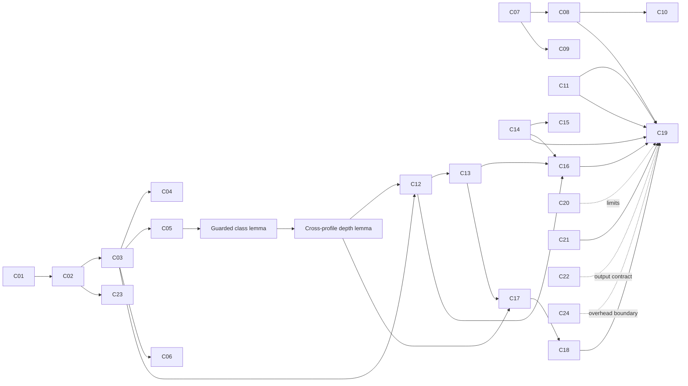

# ICHAN-DH Mathematical Specification and Internal-Correctness Proofs

Version: Gate 2 B1 reconciliation, 2026-09-06  
Status: **Gate 2 approved by the researcher; B1 contract reconciled for Gate 3**  
Decision basis: `G2-DESIGN-B`, followed by approved closure Approach B (B1, CT-only)  
Scope: internal algorithm correctness only

This document is the normative mathematical reference for ICHAN-DH version 1. It uses the section order of the proposal framework. Later flowcharts, package functions, notebook cells, and manuscript equations must agree with it. A notebook example can support implementation traceability, but it cannot replace a proof.

The specification does not establish confidentiality, authentication, steganographic undetectability, robustness to image processing, original-cover recovery, diagnostic preservation, regulatory compliance, or clinical safety. CRC32 compares the recovered payload body with a checksum stored in a parsable header; it does not protect the complete header as an authenticated unit.

## III. Approved B1 Contract for Gate 3

### A. Authority and scope

The researcher approved Gate 2 on 2026-09-06 and authorized Gate 3 without scope expansion. This section incorporates Approach B from [the multi-role review](gate2_multirole_review_and_grand_plan.md#f-three-closure-approaches). It is the operative B1 contract. The earlier candidate retained below is a historical derivation reference, **not an alternative active algorithm**. In particular, its fixed spatial prefix, padding omission, and Algorithms 3–7 are superseded here. No code implementation, execution, dataset result, or machine-checked proof follows from approval.

The abstract algorithm accepts a finite integer array of shape `(H,W)`, positive dimensions, `b` in `2..16`, signedness `s` in `{0,1}`, an immutable declared padding set, and byte payload `P` with `0 <= L = len(P) <= 2^64-1`. All traversal is row-major; byte and chunk bits are MSB-first. Arithmetic is exact integer arithmetic. The supported file interface is restricted to CT Image Storage, one two-dimensional `MONOCHROME2` frame, one sample per pixel, integer Pixel Data, matching domain/shape metadata, and supported lossless decoding. It does not apply modality, VOI, or display transformations. The abstract bit-depth domain is not a claim that every combination is a valid CT IOD.

The file interface rejects inconsistent metadata, floating/color/multiframe inputs, unsupported pixel-dependent overlay/unused-bit dependencies, and evidence of lifetime lossy processing (including `LossyImageCompression="01"`). Missing lossy-history metadata does not prove absence of historical loss. The concrete codec allowlist and per-IOD fixture checks are Gate 4 engineering obligations, not implicit support for every lossless codec or a full DICOM-conformance claim.

### B. Domain, strata, and padding

\[
d_{\min}=-s2^{b-1},\quad R=2^b-1,\quad
\mathcal D=\{d_{\min},\ldots,d_{\min}+R\},\quad z(x)=x-d_{\min},\quad N=HW.
\tag{B1.1}
\]

\[
g(x)=\begin{cases}
0,&255z(x)\le100R,\\
1,&100R<255z(x)\le150R,\\
2,&150R<255z(x),
\end{cases}\qquad D_1=(1,0,0),\ D_2=(2,1,0),\ D_3=(3,2,1).
\tag{B1.2}
\]

The tuple components of every profile `D_c` are indexed by strata `0,1,2`; equivalently, `D_c` is a function from `{0,1,2}` to nonnegative integer requested depths.

`PaddingSpec` defines a fixed set \(\Pi\): empty when both padding attributes are absent, singleton `{PPV}` for `PixelPaddingValue` alone, or the inclusive integer interval `[PPV,PPRL]`. Reject a range limit without a value; non-scalar, noninteger, out-of-domain, or signedness/VR-inconsistent attributes; and, within the supported `MONOCHROME2` subset, reversed endpoints. Do not silently reorder endpoints. Padding is declared stored-value semantics, not an inferred background mask. Preserve the presence and values of these attributes at the receiver.

For \(1\le r\le b\), let the complete aligned stored-value block be

\[
\ell_r(x)=d_{\min}+2^r\lfloor z(x)/2^r\rfloor,\qquad
\mathcal B_r(x)=\{\ell_r(x),\ldots,\ell_r(x)+2^r-1\}.
\tag{B1.3}
\]

### C. Bootstrap and guarded body

\[
e_H(x;\Pi)=\mathbf1[\mathcal B_1(x)\cap\Pi=\varnothing],\qquad
J(X)=(j_0,\ldots,j_{135}),\qquad \beta(X)=j_{135}+1.
\tag{B1.4}
\]

`J` consists of the first 136 positions with `e_H=1`, in row-major order. Formally, set \(j_{-1}=-1\) and \(j_k=\min\{i\in\{0,\ldots,N-1\}:i>j_{k-1},\ e_H(x_i;\Pi)=1\}\) for `k=0,...,135`. An undefined minimum causes `E_BOOTSTRAP_CAPACITY` before copying or modifying the cover. The **entire** prefix `[0,beta)` is reserved. Only positions in `J` receive header bits; skipped prefix positions remain unchanged. The adaptive body uses only `[beta,N)`. With empty padding, `J=(0,...,135)` and `beta=136`, provided `N>=136`. The abbreviated functions `J(X)`, `beta(X)`, and `a_pad_c(x)` all depend on the fixed `b,s,Pi` and traversal convention; those arguments are suppressed only for readability.

\[
a_c^{\mathrm{pad}}(x)=\max\!\left(\{0\}\cup
\left\{r\in\{1,\ldots,\min(D_c[g(x)],b)\}:
g(\ell_r(x))=g(x)=g(\ell_r(x)+2^r-1),\;
\mathcal B_r(x)\cap\Pi=\varnothing\right\}\right).
\tag{B1.5}
\]

The guard tests the **whole block**, not only whether `x` is padding. Evaluate candidates from the requested depth down to 1 and return the first safe candidate, otherwise 0. For an interval `[p,q]`, disjointness is `upper < p or lower > q`; it is always true for empty padding. Every padding-valued pixel has depth 0.

\[
C_c^{\mathrm{raw}}(X)=\sum_{i=\beta(X)}^{N-1}a_c^{\mathrm{pad}}(x_i),\quad
L_c^{\max}=\lfloor C_c^{\mathrm{raw}}/8\rfloor,\quad
C_c^{\mathrm{byte}}=8L_c^{\max},\quad T_c=C_c^{\mathrm{raw}}\bmod8.
\tag{B1.6}
\]

\[
c^*=\min\{c\in\{1,2,3\}:L\le L_c^{\max}\},\qquad B=8L.
\tag{B1.7}
\]

An empty feasible set causes `E_CAPACITY` at the sender or `E_LENGTH` at the receiver. A zero-byte payload selects profile 1 but still requires all 136 header carriers. `C_raw` counts writable bit slots; the byte protocol admits at most `floor(C_raw/8)` bytes. Compare `L` with that integer quotient before allocating payload-sized storage. Do not multiply an untrusted uint64 length in a fixed-width integer type.

### D. Framing and deterministic state transitions

\[
\mathsf H(P)=\texttt{ICHS}\Vert\texttt{0x01}\Vert
\operatorname{uint64be}(L)\Vert\operatorname{uint32be}(\operatorname{CRC}(P)),\qquad |\mathsf H|=17\text{ bytes}.
\tag{B1.8}
\]

The CRC is CRC-32/ISO-HDLC with zlib-compatible semantics: `zlib.crc32(P,0) & 0xffffffff`, serialized big-endian. Specified golden vectors, **not executed here**, are empty bytes → `0x00000000` and ASCII `123456789` → `0xCBF43926`. CRC covers the payload body only. Its claim is payload-checksum mismatch detection conditioned on a parsable header, not authentication or complete corruption detection. A standalone frame is `H || P`; embedding need not materialize that concatenation or a full payload bit array. Version 1 denotes this frozen B1 research protocol; compatibility with earlier unimplemented candidate layouts is not promised.

\[
E_m(x,v)=d_{\min}+2^m\lfloor z(x)/2^m\rfloor+v,\quad 0\le v<2^m;\qquad E_0(x,0)=x.
\tag{B1.9}
\]

```text
EMBED-B1(X,b,s,PaddingSpec,P)
1. Validate array, PaddingSpec, payload type and 0 <= L <= 2^64-1.
2. Reconstruct J,beta; reject E_BOOTSTRAP_CAPACITY if J is incomplete.
3. Compute all C_raw over [beta,N); select c* by (B1.7).
   If infeasible, reject E_CAPACITY. No cover copy or mutation yet.
4. Construct H; copy X to Y; write H bit t as E_1(X[J[t]], H_bit[t]).
5. Set i=beta, j=0, B=8L.
6. While i<N and j<B:
      r=a_pad_c*(X[i]); m=min(r,B-j)
      if m>0: Y[i]=E_m(X[i], next m MSB-first payload bits); j=j+m
      i=i+1                         # also advance at zero depth
7. Require j=B, otherwise E_INTERNAL; return Y with no external depth map.

EXTRACT-B1(Y,b,s,PaddingSpec)
1. Validate array and PaddingSpec; reconstruct J,beta or reject.
2. Read (Y[J[t]]-d_min) mod 2 for t=0,...,135; pack to 17 bytes.
3. Parse fixed fields; reject E_MAGIC or E_VERSION on mismatch.
4. Compute all C_raw over [beta,N). If L>floor(C_3_raw/8), E_LENGTH.
5. Select first feasible profile, then allocate recovery storage; B=8L.
6. Set i=beta, j=0. While i<N and j<B:
      r=a_pad_c*(Y[i]); m=min(r,B-j)
      if m>0: append exactly m MSB-first bits of z(Y[i]) mod 2^m; j=j+m
      i=i+1
7. Require j=B or E_LENGTH; pack exactly L bytes to P'.
8. Compare CRC(P') with header CRC; reject E_CRC on mismatch; return P'.
```

All rejections return no payload or partial stego result. `X` is immutable. Resource/allocation failures must likewise return no successful result; capacity feasibility does not guarantee available host memory. `E_DOMAIN` and `E_DICOM` retain their validation meanings. `E_BOOTSTRAP_CAPACITY` supersedes the earlier `E_HEADER_COVER` condition. Neither a header profile field nor an external per-pixel map is required.

### E. Internal-correctness proof chain

**B1-P1 — header eligibility and boundary invariance.** Assume accepted domain/padding state and sufficient header carriers. A selected header pixel stays in its original aligned one-bit block under `E_1`, so its eligibility is unchanged. Every unselected pixel before `beta` is unchanged. Thus the first 136 eligible positions are still exactly `J`; no change in the suffix can precede them. Consequently `J(Y)=J(X)` and `beta(Y)=beta(X)`. This argument does not require header stratum preservation. Obligations: skipped carriers, `beta>136`, exactly 136 eligible positions, and insufficient carriers.

**B1-P2 — padding and body-stratum preservation.** A body write of width `m<=r=a_pad_p(x)` remains inside the same aligned `r`-block. By (B1.5), that block lies wholly in one stratum and is disjoint from padding. A padding-valued pixel has no positive safe depth and is unchanged. Header carriers cannot be padding or become padding by P1. Unwritten positions are unchanged. Therefore every pixel preserves padding membership and every body pixel preserves its stratum. Obligations: singleton/range padding, both interval edges, threshold-adjacent blocks, signed extrema.

**B1-P3 — cross-profile depth invariance.** For a changed body pixel choose `r=a_pad_p(x)>0`. For candidate depth `t>r`, replacement keeps the same `t`-block, so its stratum/padding safety status is unchanged. For `t<=r`, each sub-block containing either original or modified value lies within the safe `r`-block, so both are safe. P2 preserves `g`, hence all profile request limits are unchanged. Their maximum safe candidates are identical: `a_pad_c(y)=a_pad_c(x)` for every profile `c`. Unchanged pixels satisfy this immediately. Obligations: each selected/recomputed profile pair, every permitted partial width, zero depths.

**B1-P4 — capacity and profile reconstruction.** P1 fixes the suffix; P3 fixes every summand. Thus `C_raw_c(Y)=C_raw_c(X)`, including unused suffix positions. The requested depths are pointwise ordered, so candidate sets are nested and `C_raw_1<=C_raw_2<=C_raw_3`. Flooring by 8 preserves this order. Each nonempty feasible-profile set has exactly one minimum. Once the intact header provides `L`, the receiver selects the sender's profile. Obligations: 7/8/9 raw slots, empty payload, exact fit, one byte above maximum, equal profile capacities.

**B1-P5 — exact intact-array payload recovery.** Quotient/remainder arithmetic gives `z(E_m(x,v)) mod 2^m=v`, and each complete aligned block lies within the declared domain. P1 aligns header carriers; the remainder identity with `m=1` then recovers their header bits exactly. P4 recovers the profile. Inductively, sender and receiver at position `i` share consumed length `j`, guarded depth `r`, and actual width `min(r,B-j)`. They advance identically even for `r=0`. Since the total slots are sufficient, the finite traversal reaches `j=B`; the final width cannot overrun it. MSB-first packing therefore recovers precisely `P`, and its deterministic CRC agrees. This proves

\[
\operatorname{EXTRACT}_{b,s,\Pi}(\operatorname{EMBED}_{b,s,\Pi}(X,P))=P
\tag{B1.10}
\]

for the intact array channel, identical shape/domain/padding/protocol state, valid finite input, and feasible payload. It assumes exact arithmetic and successful required resource operations. It does **not** require a DICOM object. Obligations: empty/nonempty payload, partial last chunk, trailing unused pixels, unchanged input, CRC vectors, malformed header, oversized length before allocation.

**B1-P6 — DICOM-interface corollary.** If an accepted file decodes to the abstract input and derived-file serialization followed by decoding reproduces exactly `Y` and the receiver's shape/domain/padding state, P5 applies to that file round trip. These are explicit engineering premises, not consequences of the array proof. Validation and decode-after-save fixtures remain unexecuted and belong to Gates 4–5. Full IOD conformance, truthfulness of all unknown private metadata, and clinical safety are not established.

**B1-P7 — limits and cost.** With empty padding, (B1.4) reduces to the former 136-position prefix and (B1.5) to the former stratum guard. Replacement remains non-injective in the cover: the eligible pair `0,1` can both become `0` when a zero bit is written, so original-cover recovery is not established. Header work is 136 placed bits, not `beta` placed bits. For a fixed profile `c`, `O_c=sum(i<beta) a_pad_c(x_i)` counts raw guarded slots withheld by reserving `[0,beta)`, evaluated on the original cover. This is a fixed-profile opportunity cost, not a net comparison against a hypothetical protocol that may select another profile. Report it separately from `beta`, tail waste, and actual header changes. Three fixed profiles and at most three candidate depths give worst-case `O(N+L)` array processing; DICOM codec/I/O costs are separate. Obligations: no-padding reduction, two-cover collision, variable prefix cost, raw/byte/tail accounting.

### F. Derived-output boundary and later evidence

The approved writer contract is: preserve the source file; produce a separate derived CT object with new SOP Instance identity and matching file-meta identity, a new Series Instance UID under project policy, derivation and source references, unchanged receiver domain/shape/padding metadata, and canonical uncompressed Explicit VR Little Endian output. Audit pixel-dependent metadata: recompute image extrema or remove where IOD-permitted; do not infer series extrema from one image, and remove them only where permitted. Reject unhandled pixel-dependent attributes. Remove or replace signatures/MAC material invalidated by the change, including affected nested structures. Preserve truthful lossy-history information rather than clearing it.

Serialize to a uniquely named temporary candidate in the destination directory; decode it and require exact equality to intended `Y` and receiver metadata, plus satisfaction of the derived-output contract. Publish the destination through a supported atomic rename/replace operation only after these checks. Source/destination must be distinct; do not overwrite an existing destination without authorization. Failure must leave the source and any existing destination intact and clean up the temporary candidate where possible, reporting any cleanup failure. This is failure atomicity on a filesystem supporting that operation, not a claim of crash durability or universal network-filesystem behavior. It specifies later implementation behavior; no writer was executed here.

Gate 3 uses [the three flowcharts](gate3/README.md). Gate 4 implements the frozen state machine. Gates 5–6 supply user-run implementation and empirical evidence. Dataset acquisition, steganalysis, clinical evaluation, reversibility, authentication, quantum integration, and new SOP classes are not added by this reconciliation.

## Historical candidate 1.0: derivations and audit record

The material below preserves the earlier C01–C24 derivation record. **Read current B1 definitions, pseudocode, assumptions, and proofs above instead of the superseded fixed-prefix algorithm.** Historical open-decision notices below describe the earlier review state, not the current approval status. The [proof ledger](proof_ledger.md) maps affected claims to B1-P1–P7.

## III (historical). Proposed Methodology

### A. Workflow 1: Disclosed BASMEDSecure Reproduction

Let an unsigned 8-bit cover be $X=[x_i]_{i=0}^{N-1}$, flattened in row-major order, and let the deterministic training labels be

\[
g_{8}(x)=
\begin{cases}
0,&0\le x\le100,\\
1,&101\le x\le150,\\
2,&151\le x\le255.
\end{cases}
\tag{1}
\]

The supplied prototype fits multinomial logistic regression to pairs $(x_i,g_8(x_i))$ from the cover itself and then predicts labels $\widehat g(x_i)$. Its three requested-depth profiles are

\[
D_1=(1,0,0),\qquad
D_2=(2,1,0),\qquad
D_3=(3,2,1),
\tag{2}
\]

where the tuple entries correspond to labels $0,1,2$. If $P_k$ is the number of predicted pixels in class $k$, the prototype uses

\[
C_1=P_0,\qquad
C_2=2P_0+P_1,\qquad
C_3=3P_0+2P_1+P_2
\tag{3}
\]

and selects the first case whose capacity contains the secret bit length.

Workflow 1 is a reproduction, not the proposed contribution. The following corrections are necessary for an executable baseline and must be disclosed wherever its results appear:

1. replace the dictionary assigned to `key_array` with a sequence supporting ordered append;
2. define the map as one depth entry for every visited prefix position, including zero-depth positions;
3. retain the partial-final-chunk width in the ordered map;
4. provide the complete ordered map to extraction, thereby treating it as external receiver state;
5. reject training covers containing fewer than two label classes instead of presenting a model-fit failure as an embedding result;
6. use a fresh fitted model per cover or explicitly bind the fitted state to that cover;
7. report the external map's storage/transmission cost;
8. withdraw original-cover recovery, cryptographic security, and native-DICOM claims from this baseline.

Under these corrections, a byte-aligned payload can be recovered when the exact ordered depth sequence remains available and unmodified. That statement is conditional on external state and is not the self-contained ICHAN-DH theorem.

### B. Logical Audit of the Original Algorithm

| Audit point | Local evidence | Consequence for a central claim |
|---|---|---|
| Map container | `basmedcesure.py` initializes `key_array = {}` and later calls `.append()` | Embedding cannot execute as supplied |
| Learned labels | Training targets are generated by the same fixed thresholds that the model is expected to reproduce | The fit adds no independent supervision or demonstrated information |
| Missing classes | A cover may occupy only one deterministic class | Logistic-regression fitting can be undefined even though direct classification is total |
| Receiver state | Extraction consumes an external ordered depth sequence | The stego image alone does not determine the payload traversal or endpoint |
| Reversibility | Replacement discards original low-order bits | Two different covers can produce the same stego value |
| DICOM scope | The demonstration is a random `uint8` matrix | DICOM decoding, signed stored values, native bit depth, metadata, and derived-object handling are not evaluated |
| Metrics | `data_range=255` is fixed | PSNR/SSIM are not comparable across declared 12- or 16-bit domains |
| Security | Traversal and replacement are public and CRC/authentication are absent | Visual similarity cannot establish confidentiality, authenticity, or undetectability |

These findings motivate a direct classifier, a bootstrap header, a receiver-reconstructible guarded-depth schedule, native-range validation, and bounded claims.

### C. System Model, Notation, and Preconditions

#### 1) Stored-value domain

Let $b\in\{2,\ldots,16\}$ be `BitsStored`, and let $s\in\{0,1\}$ be `PixelRepresentation`, where $s=0$ denotes unsigned storage and $s=1$ denotes two's-complement signed storage. Define

\[
d_{\min}(b,s)=
\begin{cases}
0,&s=0,\\
-2^{b-1},&s=1,
\end{cases}
\qquad
d_{\max}(b,s)=
\begin{cases}
2^b-1,&s=0,\\
2^{b-1}-1,&s=1,
\end{cases}
\tag{4}
\]

and

\[
R=d_{\max}-d_{\min}=2^b-1.
\tag{5}
\]

For a stored value $x\in\mathcal D_{b,s}=[d_{\min},d_{\max}]\cap\mathbb Z$, define its nonnegative rank code

\[
z(x)=x-d_{\min}\in\{0,\ldots,R\}.
\tag{6}
\]

All bit-replacement mathematics is applied to $z(x)$, then translated back by adding $d_{\min}$. This avoids language-dependent bitwise behavior on negative integers.

Let $X\in\mathcal D_{b,s}^{H\times W}$, $H,W\ge1$, and $N=HW$. Its row-major sequence is $x_0,\ldots,x_{N-1}$. The stego array is $Y=[y_i]$ with the same shape and declared domain.

#### 2) Payload and bit order

Let the payload be

\[
P=(p_0,\ldots,p_{L-1})\in\{0,\ldots,255\}^{L},
\qquad 0\le L\le2^{64}-1.
\tag{7}
\]

Bytes are serialized in sequence order. Within each byte, bits are ordered from most significant to least significant. The payload bit sequence is

\[
Q=\operatorname{bits}(P)=(q_0,\ldots,q_{B-1}),
\qquad B=8L.
\tag{8}
\]

For a bit chunk $q_j,\ldots,q_{j+m-1}$, define

\[
\operatorname{val}(Q[j:j+m])=
\sum_{t=0}^{m-1}q_{j+t}2^{m-1-t}.
\tag{9}
\]

#### 3) DICOM acceptance predicate

The version-1 DICOM loader accepts an object only when all of the following are true:

- decoding yields exactly one two-dimensional frame with shape `(Rows, Columns)`;
- `SamplesPerPixel = 1` and `PhotometricInterpretation = MONOCHROME2`;
- integer `PixelData` is used; floating-point pixel data are absent;
- `BitsStored=b` is between 2 and 16, `HighBit=b-1`, and `BitsStored <= BitsAllocated`;
- `PixelRepresentation=s` is either 0 or 1 and agrees with the decoded numeric interpretation;
- the transfer syntax is native uncompressed or losslessly compressed and a lossless decoder is available;
- no lossy source is accepted for the correctness campaign;
- every observed decoded value lies in $\mathcal D_{b,s}$;
- the decoded sample count is exactly $HW$;
- classification and embedding occur before Modality LUT/rescale, VOI LUT/windowing, and display conversion.

The conservative implementation profile may further restrict `BitsAllocated` to 8 or 16. Rescale attributes may exist, but they are not applied to the stored-value classifier.

**Open Gate 2 DICOM issue.** The predicate above does not yet constrain `PixelPaddingValue` or `PixelPaddingRangeLimit`. The fixed-prefix and body rules can change membership in the declared padding set while leaving those attributes unchanged. Consequently C21-C22 and the DICOM interpretation of C19 are not ready for acceptance. The normative algorithm remains unchanged pending the researcher's choice between restriction B0 and revision B1 in [`gate2_adversarial_review_2022_2026.md`](gate2_adversarial_review_2022_2026.md). The abstract-array results that do not assert DICOM metadata truthfulness remain available under their stated assumptions.

#### 4) Failure symbols

The algorithms use named rejection categories rather than returning partial data:

| Symbol | Meaning |
|---|---|
| `E_DOMAIN` | Invalid array dimensionality, integer type, range, or signedness |
| `E_DICOM` | Unsupported or inconsistent DICOM attributes/transfer syntax |
| `E_HEADER_COVER` | Fewer than 136 cover pixels |
| `E_CAPACITY` | No guarded profile can contain the payload |
| `E_MAGIC` | Wrong four-byte frame magic |
| `E_VERSION` | Unsupported frame version |
| `E_LENGTH` | Length is impossible, truncated, or exceeds guarded capacity |
| `E_CRC` | Recovered payload CRC32 differs from the header |
| `E_INTERNAL` | A supposedly unreachable invariant violation |

Rejection must occur before returning payload bytes. `E_CAPACITY` must occur before cover mutation.

#### Proposition C01: accepted-array domain

If the array validation predicate accepts $X,b,s$, then $X\in\mathcal D_{b,s}^{H\times W}$ for finite positive $H,W$.

**Proof.** Acceptance requires two dimensions, positive shape, integer samples, and an elementwise range check against (4). Therefore every one of the $HW$ elements is an integer in $\mathcal D_{b,s}$, which is exactly membership in the stated Cartesian product. ∎

#### Proposition C02: domain cardinality and span

For either signedness value, $|\mathcal D_{b,s}|=2^b$ and $d_{\max}-d_{\min}=2^b-1$.

**Proof.** For $s=0$, the inclusive range $0,\ldots,2^b-1$ has $2^b$ values. For $s=1$, the inclusive count is $2^{b-1}-1-(-2^{b-1})+1=2^b$. Subtracting the endpoints gives (5) in both cases. ∎

### D. Step 1: Deterministic Native-Domain Classification

Define normalized rank

\[
q_{b,s}(x)=\frac{x-d_{\min}}{R}=\frac{z(x)}{R}.
\tag{10}
\]

The ICHAN-DH class function uses integer arithmetic:

\[
g_{b,s}(x)=
\begin{cases}
0,&255z(x)\le100R,\\
1,&100R<255z(x)\le150R,\\
2,&150R<255z(x).
\end{cases}
\tag{11}
\]

Equivalently, define

\[
t_0=d_{\min}+\left\lfloor\frac{100R}{255}\right\rfloor,
\qquad
t_1=d_{\min}+\left\lfloor\frac{150R}{255}\right\rfloor,
\tag{12}
\]

and classify $[d_{\min},t_0]$, $[t_0+1,t_1]$, and $[t_1+1,d_{\max}]$. A middle class may be empty at very small bit depths; this does not make the function partial.

#### Algorithm 1: native-domain classification

```text
CLASSIFY-NATIVE(X, b, s)
Require: VALID-ARRAY(X, b, s)
1. Compute d_min and R from (4)-(5).
2. For every row-major pixel x:
      z <- x - d_min
      if 255*z <= 100*R: label <- 0
      else if 255*z <= 150*R: label <- 1
      else: label <- 2
3. Return the label array with the same shape as X.
Ensure: every output is in {0,1,2}.
```

#### Proposition C03: total, unique partition

Every $x\in\mathcal D_{b,s}$ receives exactly one label in $\{0,1,2\}$.

**Proof.** Let $a=255z(x)$. Exactly one of the mutually exclusive conditions $a\le100R$, $100R<a\le150R$, or $150R<a$ holds by trichotomy and because $100R\le150R$. Their union covers every integer $a$. ∎

#### Proposition C04: exact unsigned 8-bit reduction

For $b=8,s=0$, (11) equals (1).

**Proof.** Here $d_{\min}=0$ and $R=255$. The first condition becomes $255x\le25500$, or $x\le100$. The second becomes $100<x\le150$, and the third $x>150$. On the unsigned 8-bit integers these are exactly the intervals in (1). ∎

#### Proposition C05: monotonicity

If $x_1\le x_2$, then $g_{b,s}(x_1)\le g_{b,s}(x_2)$.

**Proof.** Subtracting the same $d_{\min}$ and multiplying by positive 255 preserve order. The three decision intervals in (11) are ordered by increasing boundary. Moving right cannot enter a lower-index interval. ∎

#### Proposition C06: deterministic-target consistency

For any finite sample $x_1,\ldots,x_n$, direct evaluation of $g$ has zero empirical disagreement with targets defined by $y_i=g(x_i)$:

\[
\frac1n\sum_{i=1}^{n}\mathbf 1[g(x_i)\ne y_i]=0.
\tag{13}
\]

**Proof.** Substitution of $y_i=g(x_i)$ makes every indicator zero. This proves that relearning the generated targets is unnecessary; it does not prove that a fitted logistic-regression model reproduces them exactly. ∎

#### Corollary D1: exact representation invariance

If $q_{b,s}(x)=q_{b',s'}(x')$, then $g_{b,s}(x)=g_{b',s'}(x')$.

**Proof.** Dividing (11) by positive $255R$ shows that the decision depends only on whether $q$ lies below, between, or above $100/255$ and $150/255$. Equal normalized coordinates have identical comparisons. ∎

This includes signed/unsigned translation at fixed bit depth and exact full-scale mappings such as (x'=257x) from unsigned 8-bit to unsigned 16-bit.

#### Corollary D2: quantization-stability bound

Let $\mathcal T=\{100/255,150/255\}$. If normalized coordinates satisfy $|q-q'|\le\varepsilon$ and

\[
\min_{t\in\mathcal T}|q-t|>\varepsilon,
\tag{14}
\]

then their classes agree.

**Proof.** The closed interval $[q-\varepsilon,q+\varepsilon]$ contains no threshold, so $q$ and $q'$ remain in the same decision region. ∎

#### Counterexample D3: no physical-value invariance

Let a modality transformation be $u=mx+\beta$. In an unsigned 12-bit domain, the same $u=0$ is represented by $x_1=1024$ for $(m,\beta)=(1,-1024)$ and by $x_2=2048$ for $(m,\beta)=(0.5,-1024)$. Equation (12) gives $t_0=1605$ and $t_1=2408$. Therefore $g(x_1)=0$ while $g(x_2)=1$. ICHAN-DH is representation-normalized, not clinically or physically normalized.

### E. Step 2: Payload Framing and Fixed Bootstrap

Let

- $M=\texttt{ICHS}$ be four ASCII magic bytes;
- $V=1$ be one version byte;
- $\operatorname{len}_{64}(L)$ be an eight-byte unsigned big-endian length;
- $C(P)$ be the four-byte unsigned big-endian CRC32 of $P$.

Define the header and logical frame

\[
H(P)=M\Vert V\Vert\operatorname{len}_{64}(L)\Vert C(P),
\qquad
F(P)=H(P)\Vert P.
\tag{15}
\]

The field layout is:

| Offset | Width | Field | Validation |
|---:|---:|---|---|
| 0 | 4 bytes | Magic | exactly `ICHS` |
| 4 | 1 byte | Version | exactly 1 |
| 5 | 8 bytes | Payload length $L$ | unsigned big-endian; feasible for the received cover |
| 13 | 4 bytes | CRC32 | equals CRC32 of the recovered payload |
| 17 | $L$ bytes | Payload body | exactly $L$ bytes |

Thus the header size is $h_B=17$ bytes and its fixed bootstrap length is

\[
h=8h_B=136\text{ bits/pixels}.
\tag{16}
\]

The header is embedded one bit per row-major pixel at indices $0,\ldots,135$. These positions are excluded from adaptive capacity. The payload body begins at index 136. Header pixels need not preserve their class because the adaptive stage never revisits them.

#### Algorithm 2A: construct header and frame

```text
FRAME(P)
Require: P is a byte sequence and 0 <= len(P) <= 2^64 - 1.
1. L <- len(P).
2. H <- b"ICHS" || BYTE(1) || UINT64-BE(L) || UINT32-BE(CRC32(P)).
3. Return (H, H || P).
Ensure: len(H) = 17 and len(H || P) = 17 + L.
```

#### Algorithm 2B: parse a standalone logical frame

```text
UNFRAME(F)
1. If len(F) < 17, reject E_LENGTH.
2. Parse magic, version, L, and expected_crc from fixed offsets.
3. If magic != b"ICHS", reject E_MAGIC.
4. If version != 1, reject E_VERSION.
5. If len(F) != 17 + L, reject E_LENGTH.
6. P <- F[17 : 17 + L].
7. If CRC32(P) != expected_crc, reject E_CRC.
8. Return P.
```

#### Proposition C07: exact frame size

For a payload of $L$ bytes, $|H(P)|=17$ and $|F(P)|=L+17$ bytes.

**Proof.** The fixed fields contain $4+1+8+4=17$ bytes. Concatenating the $L$-byte body produces $17+L$. ∎

#### Proposition C08: frame round trip

For every supported payload $P$, `UNFRAME(FRAME(P).frame) = P`.

**Proof.** Construction writes the required magic/version, the exact $L$, CRC32 of the same body, and then $P$. Parsing therefore accepts all fixed predicates, slices exactly the appended $L$ bytes, and observes the same deterministic CRC32. ∎

#### Proposition C09: unique logical endpoint and injectivity

Given a known frame start and a complete valid header, the accepted logical endpoint is uniquely $17+L$. Also, $P_a\ne P_b\Rightarrow F(P_a)\ne F(P_b)$.

**Proof.** The fixed offsets encode one unsigned integer $L$, so exact-length validation permits one endpoint. If two payload lengths differ, their length fields differ. If lengths agree but bodies differ, the suffixes differ. Hence frames are injective. ∎

#### Proposition C10: explicit malformed-frame rejection

Algorithms 2B and 6 reject a short header, wrong magic, unsupported version, impossible/truncated length, or CRC mismatch before returning payload bytes.

**Proof.** Each invalid condition is the negation of a stated acceptance predicate and has a preceding rejection branch. CRC32 collisions remain possible, so this is not a claim that all malicious or random modifications are detected. ∎

#### Proposition C11: byte/bit bijection

For every finite byte sequence $A$, `BITS-TO-BYTES(BYTES-TO-BITS(A)) = A` under the MSB-first convention.

**Proof.** Each byte $a\in[0,255]$ has a unique eight-bit base-2 expansion. The forward map concatenates those expansions without reordering; the inverse partitions at the same multiples of eight and applies the inverse base-2 evaluation. Therefore each byte and its position are preserved. Partial non-byte-aligned sequences are not accepted by this inverse. ∎

### F. Step 3: Guarded Capacity and Profile Selection

#### 1) Requested depths

Let $D_c(k)$ be entry $k$ of profile $c\in\{1,2,3\}$ in (2). Cap it by the stored bit depth:

\[
d_c(k;b)=\min(D_c(k),b).
\tag{17}
\]

The profiles remain pointwise ordered:

\[
d_1(k;b)\le d_2(k;b)\le d_3(k;b).
\tag{18}
\]

#### 2) Replacement blocks and safety

For $1\le r\le b$, define the rank-code block containing $x$:

\[
\lambda_r(x)=2^r\left\lfloor\frac{z(x)}{2^r}\right\rfloor,
\qquad
\upsilon_r(x)=\lambda_r(x)+2^r-1.
\tag{19}
\]

Because $R=2^b-1$ and $r\le b$, these blocks partition $\{0,\ldots,R\}$, and $0\le\lambda_r\le\upsilon_r\le R$. Define

\[
S_r(x)=
\mathbf 1\left[
g(d_{\min}+\lambda_r(x))
=g(x)
=g(d_{\min}+\upsilon_r(x))
\right].
\tag{20}
\]

By monotonicity of $g$, $S_r(x)=1$ means every value in the entire block has class $g(x)$.

The guarded depth is

\[
a_c(x)=
\max\left(
\{0\}\cup
\{r\in\{1,\ldots,d_c(g(x);b)\}:S_r(x)=1\}
\right).
\tag{21}
\]

This fallback rule selects the largest safe depth no greater than the requested profile depth. It is deterministic and payload-independent.

#### Algorithm 3: guarded depth

```text
GUARDED-DEPTH(x, b, s, profile c)
Require: x is in D_(b,s), c in {1,2,3}.
1. k <- CLASSIFY-NATIVE(x, b, s).
2. requested <- min(D_c[k], b).
3. For r from requested down to 1:
      lower <- d_min + 2^r * floor((x - d_min) / 2^r)
      upper <- lower + 2^r - 1
      if CLASSIFY(lower) = k and CLASSIFY(upper) = k:
          return r
4. Return 0.
```

#### 3) Capacity

Only indices $i\ge h$ belong to the adaptive channel. Define

\[
C_c(X)=\sum_{i=h}^{N-1}a_c(x_i)
\quad\text{bits},
\tag{22}
\]

with an empty sum equal to zero. For payload body length $B=8L$, select

\[
c^*(X,B)=
\min\{c\in\{1,2,3\}:B\le C_c(X)\}.
\tag{23}
\]

If this set is empty, reject `E_CAPACITY` before copying or modifying the cover. Empty payloads select profile 1.

#### Algorithm 4: capacity and profile selection

```text
SELECT-PROFILE(X, b, s, B)
Require: VALID-ARRAY(X,b,s) and N >= 136.
1. For c in (1,2,3):
      C[c] <- sum(GUARDED-DEPTH(x_i,b,s,c) for i = 136,...,N-1)
2. Return the first c for which B <= C[c].
3. If none exists, reject E_CAPACITY.
```

#### Proposition C12: exact guarded capacity

$C_c(X)$ is exactly the maximum number of body bits Algorithm 5 can consume using profile $c$ and the fixed traversal.

**Proof.** Position $i\ge h$ offers exactly $a_c(x_i)$ bit slots by definition. Slots from different positions are disjoint. Their finite sum is therefore an achievable upper bound: fill each position with its full guarded depth in traversal order. No algorithm obeying these per-position limits can use more than their sum. ∎

#### Proposition C13: ordered, unique minimal feasible profile

Capacities satisfy $C_1(X)\le C_2(X)\le C_3(X)$. When at least one profile is feasible, (23) returns exactly one minimal profile.

**Proof.** Equation (18) makes the candidate safe-depth set for profile $c$ a subset of the set for profile $c+1$. Taking maxima gives $a_c(x)\le a_{c+1}(x)$ for each pixel; summing proves capacity monotonicity. A nonempty subset of the finite total order $1<2<3$ has one minimum. ∎

#### Lemma F1: guarded class preservation

If $r=a_c(x)>0$ and at most $r$ low rank-code bits are replaced, the resulting $y$ satisfies $g(y)=g(x)$.

**Proof.** Replacing at most $r$ low bits cannot change the quotient $\lfloor z/2^r\rfloor$, so $y$ remains in the same $r$-block. Equation (21) selected a block whose two endpoints have class $g(x)$. Monotonicity in Proposition C05 makes every value between them share that class. ∎

#### Lemma F2: cross-profile depth invariance

Suppose $y$ is obtained from $x$ by replacing $m\le a_p(x)$ low rank-code bits under any selected profile $p$. Then, for every profile $c\in\{1,2,3\}$,

\[
a_c(y)=a_c(x).
\tag{24}
\]

**Proof.** If $a_p(x)=0$, no replacement occurs and the claim is immediate. Otherwise let $r=a_p(x)>0$. Lemma F1 gives $g(y)=g(x)$. Replacement of at most $r$ low bits preserves membership in every block of depth $t>r$, so the safety status of every candidate $t>r$ is unchanged. The selected $r$-block lies entirely in one class; consequently every sub-block of depth $t\le r$ containing either $x$ or $y$ also lies in that class and is safe. Thus, for any requested profile limit, the greatest safe candidate is unchanged: a maximum above $r$ retains the same block status, while a maximum at or below $r$ remains the greatest permitted safe sub-block. ∎

Lemma F2 is stronger than preserving the selected profile alone. It is what permits the receiver to recompute all three capacities and independently recover the sender's case.

### G. Step 4: Embedding Transformation

For $0\le m\le b$ and chunk integer $v\in\{0,\ldots,2^m-1\}$, define rank-code LSB replacement

\[
E_m(x,v)=
d_{\min}
+2^m\left\lfloor\frac{x-d_{\min}}{2^m}\right\rfloor
+v,
\tag{25}
\]

with $E_0(x,0)=x$.

#### Fixed header operation

If $r_i$ is header bit $i$, the first $h=136$ pixels are transformed as

\[
y_i=E_1(x_i,r_i),\qquad 0\le i<h.
\tag{26}
\]

Header bits can change their pixels' labels; those positions are reserved and excluded from (22).

#### Adaptive body operation

Let $c^*=c^*(X,B)$. At body position $i$, let $r_i=a_{c^*}(x_i)$, let $j$ be the number of body bits already embedded, and set

\[
m_i=\min(r_i,B-j).
\tag{27}
\]

If (m_i>0), write

\[
y_i=E_{m_i}\left(x_i,\operatorname{val}(Q[j:j+m_i])\right)
\tag{28}
\]

and advance $j\leftarrow j+m_i$. If $m_i=0$, leave the pixel unchanged. Stop when $j=B$; all later pixels remain unchanged.

#### Algorithm 5: ICHAN-DH embedding

```text
EMBED-ICHAN-DH(X, b, s, P)
Require: valid supported stored-value array and byte payload.
1. Validate X,b,s; if N < 136, reject E_HEADER_COVER.
2. (H, F) <- FRAME(P); Q <- BYTES-TO-BITS(P); B <- len(Q).
3. c <- SELECT-PROFILE(X,b,s,B).
   This is the final capacity decision; no mutation has occurred.
4. Y <- an exact copy of X.
5. header_bits <- BYTES-TO-BITS(H).
6. For i = 0,...,135:
      Y[i] <- E_1(X[i], header_bits[i]).
7. j <- 0.
8. For i = 136,...,N-1 while j < B:
      r <- GUARDED-DEPTH(X[i],b,s,c)
      m <- min(r, B-j)
      if m > 0:
          v <- VAL(Q[j:j+m])
          Y[i] <- E_m(X[i],v)
          j <- j+m
9. If j != B, reject E_INTERNAL.
10. Return Y and no external depth map.
Ensure: X is unchanged; Y has the same shape/domain; the body contains B bits.
```

The logical frame variable $F$ is useful for standalone protocol tests; spatial embedding sends $H$ through the fixed channel and $P$ through the adaptive channel.

#### Proposition C14: replacement correctness

For $m>0$,

\[
(E_m(x,v)-d_{\min})\bmod 2^m=v.
\tag{29}
\]

**Proof.** Equation (25) has rank code $2^m q+v$ for integer quotient $q$. Reduction modulo $2^m$ removes the first term and leaves $v$. ∎

#### Lemma G1: consistency with signed stored LSBs

For a signed $b$-bit sample and every width actually used by Algorithms 5-6, rank-code low bits equal the low bits of the $b$-bit two's-complement stored representation.

**Proof.** For signed samples, $z(x)=x+2^{b-1}$. The only aligned block of depth $b$ is the full stored-value domain. It contains values in both extreme intensity classes, so it is not class-safe and no body position can receive guarded depth $b$. Hence every used body width satisfies $m\le b-1$; the header uses $m=1$ and the domain requires $b\ge2$. In either case $2^m$ divides $2^{b-1}$, giving $z(x)\equiv x\pmod{2^m}$. Thus the rank-code remainder used for replacement and extraction is the stored two's-complement low-bit remainder, while equation (25) avoids implementation-dependent bitwise operations on negative host-language integers. ∎

#### Proposition C15: range preservation

If $x\in\mathcal D_{b,s}$, $m\le b$, and $0\le v<2^m$, then $E_m(x,v)\in\mathcal D_{b,s}$.

**Proof.** The rank-code domain $[0,2^b-1]$ is partitioned into complete aligned blocks of size $2^m$. Equation (25) selects a member of the same block as $z(x)$, so its rank code remains between 0 and $R$. Adding $d_{\min}$ returns a value in $\mathcal D_{b,s}$. ∎

#### Proposition C16: exact consumption and termination

If $B\le C_{c^*}(X)$, Algorithm 5 consumes all and only the $B$ payload bits and terminates without modifying a position after the endpoint.

**Proof.** Before each body iteration, use the invariant: (i) $0\le j\le B$; (ii) the first $j$ payload bits occupy the processed positive-depth chunks in order; (iii) no unprocessed body position has been changed; and (iv) every changed body pixel used a width no greater than its guarded depth. The invariant holds at $j=0$. One iteration either leaves $j$ unchanged at a zero-depth position or writes exactly the next $m=\min(r,B-j)$ bits and advances by $m$, preserving all four statements. The finite traversal offers a total of $C_{c^*}(X)\ge B$ slots, so $j$ reaches $B$ no later than the last body position. The loop condition then stops before any later position is modified. The variant pair $(N-i,B-j)$ in lexicographic order strictly decreases on each iteration, proving termination. ∎

### H. Step 5: Extraction and State Recovery

Extraction first recovers the fixed header, then derives the body profile and per-position depths from the received stego array.

#### Algorithm 6: ICHAN-DH extraction

```text
EXTRACT-ICHAN-DH(Y, b, s)
Require: valid supported stored-value stego array.
1. Validate Y,b,s; if N < 136, reject E_HEADER_COVER.
2. For i = 0,...,135:
      header_bit[i] <- (Y[i] - d_min) mod 2.
3. H <- BITS-TO-BYTES(header_bit).
4. Parse fixed offsets in H.
   Reject E_MAGIC or E_VERSION on mismatch.
5. B <- 8*L.
6. Compute C_1(Y), C_2(Y), C_3(Y) over indices 136,...,N-1.
   If B > C_3(Y), reject E_LENGTH.
7. c <- the first profile with B <= C_c(Y).
8. j <- 0; recovered_bits <- empty.
9. For i = 136,...,N-1 while j < B:
      r <- GUARDED-DEPTH(Y[i],b,s,c)
      m <- min(r, B-j)
      if m > 0:
          v <- (Y[i] - d_min) mod 2^m
          append the fixed-width m-bit representation of v
          j <- j+m
10. If j != B, reject E_LENGTH.
11. P' <- BITS-TO-BYTES(recovered_bits).
12. If CRC32(P') differs from the CRC field in H, reject E_CRC.
13. Return P'.
```

The parser must validate the recovered length against $C_3(Y)$ before allocating or iterating over a payload-sized object. Trailing unused cover capacity is ignored because $B$ is explicit.

#### Proposition C17: sender/receiver state alignment

For an unmodified output $Y=\operatorname{EMBED}(X,P)$, extraction selects the same profile and reads the same width at every used body position.

**Proof.** Header replacement satisfies Proposition C14 with $m=1$, so extraction reconstructs $H(P)$ exactly and obtains the sender's $B$. Header positions are not part of capacity. For every body position changed by the sender, Lemma F2 gives $a_c(y_i)=a_c(x_i)$ for all profiles $c$; unchanged positions satisfy the same equality trivially. Hence $C_c(Y)=C_c(X)$ for all $c$. Equation (23) therefore selects the same minimal feasible profile. Induct on body traversal: if both parties have processed $j$ bits before position $i$, they compute the same guarded depth and the same $m=\min(r,B-j)$, then advance by the same amount. The state remains aligned through the endpoint. ∎

#### Proposition C18: exact extraction endpoint

For an unmodified valid stego array, Algorithm 6 stops after exactly $B=8L$ body bits and does not interpret unused cover capacity as payload.

**Proof.** The fixed header uniquely supplies $L$. Proposition C17 aligns every width. The loop guard is $j<B$, and the final width is reduced to $B-j$, so $j$ cannot exceed $B$. Capacity feasibility guarantees it reaches $B$. The loop then stops regardless of remaining pixels. ∎

#### Theorem C19: end-to-end payload recovery

Assume:

1. the sender and receiver use this version and identical $b,s$ metadata;
2. the input satisfies the declared domain and DICOM contract;
3. $N\ge136$ and a feasible profile exists;
4. no header/body pixel or required metadata is modified after embedding;
5. both parties use the declared row-major traversal and bit order.

Then

\[
\operatorname{EXTRACT}(\operatorname{EMBED}(X,P))=P.
\tag{30}
\]

**Proof.** Proposition C17 aligns profile, positions, and widths. Proposition C14 recovers every chunk value, so concatenation yields the original $B$-bit sequence. Proposition C18 yields the exact byte-aligned endpoint. Proposition C11 reconstructs the original payload bytes. The recovered header fields are those constructed for $P$, so CRC validation succeeds as in Proposition C08. ∎

This theorem is deterministic correctness under an intact channel. It is not a robustness or security theorem.

#### Proposition C20: original cover is not recoverable

ICHAN-DH LSB replacement is not injective in the cover argument and therefore is not reversible without additional state.

**Proof by counterexample.** In unsigned 8-bit class 0, both $x=0$ and $x'=1$ have a safe one-bit block $\{0,1\}$. Embedding bit 0 gives $E_1(0,0)=0$ and $E_1(1,0)=0$. Two distinct covers produce the same stego value for the same embedded bit. No inverse can determine which original was used. The fixed header channel has the same many-to-one property. ∎

#### Corruption boundary

An altered header may be rejected by magic, version, or capacity checks. An altered body or CRC field may be rejected when the recovered payload checksum differs from the CRC field. The checksum input is the payload body only: the magic, version, length, and CRC field are not jointly checksum-covered or authenticated. CRC32 also admits collisions, and an adversary can recompute it. No probability of detection, authenticity, or tamper resistance is claimed.

### I. Step 6: DICOM Input and Derived-Object Handling

#### Algorithm 7A: decoded stored-value input contract

```text
LOAD-SUPPORTED-DICOM(dataset)
1. Validate the DICOM acceptance predicate in Section III-C.3.
2. Decode PixelData losslessly using the declared transfer syntax.
3. Verify shape, sample count, integer interpretation, and observed range.
4. Return a copy of the decoded stored-value array plus b and s.
5. Do not apply modality rescale/LUT, VOI LUT/windowing, or display conversion.
```

#### Proposition C21: DICOM load boundary

If Algorithm 7A accepts a dataset, the returned pixel array satisfies the abstract input model used by C01-C20.

**Proof.** The acceptance predicate explicitly checks every abstract requirement: two-dimensional finite integer array, declared bit depth/signedness, exact sample count, and elementwise membership in $\mathcal D_{b,s}$. Lossless decoding changes representation, not decoded stored values. Therefore the returned tuple is a valid instance of the model. This is an interface-contract proof, not full DICOM IOD conformance. ∎

#### Algorithm 7B: derived-output engineering contract

A Gate 4 writer must:

1. never overwrite the source object in place;
2. write the stego stored values using a supported integer `PixelData` representation;
3. preserve `Rows`, `Columns`, `SamplesPerPixel`, `PhotometricInterpretation`, `BitsAllocated`, `BitsStored`, `HighBit`, and `PixelRepresentation` when their meanings remain valid;
4. emit a declared lossless representation, with uncompressed Explicit VR Little Endian as the version-1 canonical output unless a separately validated lossless encoder is selected;
5. create a new SOP Instance UID and matching file-meta instance UID;
6. create a new Series Instance UID under the ICHAN version-1 research-derivative policy; this is a project policy, not asserted as a universal DICOM requirement;
7. identify the object as derived and record a non-security-claiming derivation description;
8. reference the source instance where the chosen SOP class permits the appropriate source-reference attributes;
9. remove or replace digital-signature/MAC attributes that no longer validate after `PixelData` changes;
10. reject serialization if a round-trip decoder would not reproduce the intended stored-value array and metadata contract.

#### Proposition C22: metadata truthfulness obligation

An output satisfying Algorithm 7B does not reuse the source instance identity for modified pixel data and does not retain known-stale signatures as if they remained valid.

**Justification.** Pixel modification creates a derived object. New instance identity separates it from the source, derivation metadata records the transformation, and removal/replacement of invalid signatures prevents a known false integrity representation. This is a standards-grounded engineering obligation to be reviewed again at Gate 4; it is not a mathematical proof of complete DICOM conformance.

### J. Complexity, Metrics, and Storage Overhead

#### 1) Payload, header, and map rates

For $N$ cover pixels and payload $B=8L$ bits, define

\[
\rho_{\text{net}}=\frac{B}{N}\quad\text{payload bits/pixel},
\qquad
\rho_{\text{placed}}=\frac{B+136}{N}\quad\text{placed bits/pixel}.
\tag{31}
\]

For $L>0$, header overhead relative to payload is

\[
\omega_H=\frac{17}{L}=\frac{136}{B},
\tag{32}
\]

and the header share of the logical frame is $17/(17+L)$. For $L=0$, relative overhead is undefined but the valid header still occupies 17 bytes and 136 cover positions.

Guard utilization under profile $c$ is

\[
U_c=\frac{B}{C_c(X)}
\tag{33}
\]

when $C_c(X)>0$. Threshold-guard capacity loss relative to the unguarded profile is

\[
\Delta C_c=
\sum_{i=h}^{N-1}d_c(g(x_i);b)-C_c(X).
\tag{34}
\]

#### Proposition C24: side-information accounting

For $V$ position-aligned entries, a direct fixed-width depth map with symbols in $\{0,1,2,3\}$ costs exactly $2V$ bits. The map space has $4^V$ states, so every injective representation of all such maps has worst-case length at least

\[
\log_2(4^V)=2V
\tag{35}
\]

bits before container/protection overhead. Compression can reduce particular maps but cannot guarantee less for every map. The baseline accounting must use its actual mapped-position count $V$ and must separately include any encoded endpoint, representation boundary, and protection/container metadata.

ICHAN-DH transmits no depth map. Its mandatory algorithmic overhead is the 136-bit fixed header embedded in reserved pixels; normal DICOM attributes $b,s,H,W$ are part of the received object rather than a secret auxiliary map. Any future key, nonce, authentication tag, permutation description, or compressed map must be added explicitly to the overhead equation.

#### 2) Distortion and recovery metrics

For cover $X$ and stego $Y$, use the declared native range $R=2^b-1$:

\[
\operatorname{MSE}(X,Y)=\frac1N\sum_{i=0}^{N-1}(x_i-y_i)^2,
\tag{36}
\]

\[
\operatorname{PSNR}(X,Y)=
\begin{cases}
+\infty,&\operatorname{MSE}=0,\\
10\log_{10}\left(\frac{R^2}{\operatorname{MSE}}\right),&\operatorname{MSE}>0.
\end{cases}
\tag{37}
\]

SSIM must likewise declare `data_range=R`; window size and channel handling must be valid for the two-dimensional monochrome array. Additional exactness metrics are

\[
\operatorname{BER}=\frac{1}{B}\sum_{j=0}^{B-1}\mathbf 1[q_j\ne\widehat q_j]
\tag{38}
\]

for $B>0$, and an exact-recovery indicator $\mathbf 1[P=\widehat P]$. Define empty-payload BER as 0 by convention and report the convention.

Other required descriptive metrics are modified-pixel fraction, maximum absolute stored-value change, guarded capacity, selected profile, header overhead, runtime, and peak memory. None is a proxy for steganographic security or diagnostic safety.

#### Proposition C23: native-range metric consistency

Equations (36)-(37) compare distortion relative to the full declared stored-value span for every supported signed or unsigned bit depth.

**Proof.** Proposition C02 establishes that the endpoint difference is $R=2^b-1$ regardless of signedness. Using this same $R$ in every metric normalizes against the declared domain rather than a hard-coded 8-bit range. This establishes definition/code consistency only; it does not make PSNR or SSIM a clinical or security measure. ∎

#### 3) Time and space complexity

Let $N=HW$ and $L$ be payload bytes.

| Operation | Time | Auxiliary/output space | Reason |
|---|---:|---:|---|
| Input validation and classification | $\Theta(N)$ | $\Theta(N)$ if labels are materialized; $O(1)$ streaming | Every pixel is inspected |
| Header construction/parsing | $\Theta(L)$ including CRC/copy; $O(1)$ fixed-field work | $\Theta(L)$ for frame/payload output | CRC input is the payload body, not the complete header |
| Three-profile guarded capacity | $\Theta(N)$ | $O(1)$ streaming | Three is constant; each pixel checks at most three depths |
| Embedding | $\Theta(N+L)$ worst case | $\Theta(N+L)$ including output copy and payload bits | Fixed traversal plus serialization |
| Extraction | $\Theta(N+L)$ worst case | $\Theta(L)$ excluding received image | Fixed traversal plus recovered payload |
| BASMED external full map | $\Theta(N)$ entries | $\Theta(N)$ | One ordered depth symbol per aligned position |

The canonical implementation may avoid a materialized label array and bit-string representation, but such optimization must preserve the specified order and chunk semantics.

### K. Correctness Summary, Dependencies, and Verification Contract

#### 1) End-to-end assumptions

The complete internal-correctness claim depends on all of the following:

- **A1:** the input satisfies the version-1 array and DICOM predicate;
- **A2:** sender and receiver use identical `BitsStored` and `PixelRepresentation`;
- **A3:** both use version 1 constants, byte order, bit order, and row-major traversal;
- **A4:** $N\ge136$;
- **A5:** the payload length is at most $2^{64}-1$ and profile 3 is feasible;
- **A6:** capacity is computed before mutation on body indices only;
- **A7:** header and body pixels are not altered between embedding and extraction;
- **A8:** the DICOM decoding path is lossless in stored-value space;
- **A9:** no modality/VOI/display transform is inserted into the embedding domain;
- **A10:** integer operations do not overflow before comparisons or products are evaluated;
- **A11:** extraction validates length feasibility before payload-sized allocation;
- **A12:** no original-cover, authenticity, secrecy, undetectability, robustness, or clinical claim is inferred from C19;
- **A13:** until B0 or B1 is approved and incorporated, a DICOM-level use of C19 additionally assumes that pixel-padding attributes are absent.

#### 2) Proof dependency graph



#### 3) Claim-to-artifact traceability

| Claim | Normative section | Planned package owner | Required `ICHAN-TV1` evidence | Gate 2 status |
|---|---|---|---|---|
| C01-C02 | III-C | `core.py`, `dicom_io.py` | Domain accept/reject grid for signed/unsigned 2-16 bits | drafted |
| C03-C06 | III-D | `core.py`, `baseline.py` | 8-bit boundaries, exhaustive small domains, model-target comparison | drafted |
| C07-C10 | III-E | `core.py` | Empty/nonempty frames and named malformed-frame matrix | drafted |
| C11 | III-C/III-E | `core.py` | Fixed byte vectors and seeded round trips | drafted |
| C12-C13 | III-F | `core.py` | Exhaustive small covers, exact-fit/one-short, case boundaries | drafted |
| C14-C16 | III-G | `core.py` | Exhaustive replacement values, range edges, partial final chunks | drafted |
| C17-C19 | III-F/III-H | `core.py` | Cross-profile invariance and exact payload round-trip grid | drafted |
| C20 | III-H | `core.py` | Two-cover collision demonstration | drafted |
| C21-C22 | III-C/III-I | `dicom_io.py` | Minimal valid DICOM plus one violation per contract branch; output metadata inspection | drafted |
| C23 | III-J | `metrics.py` | Identical and controlled one-level arrays at 8/12/16 bits | drafted |
| C24 | III-J | `metrics.py`, analysis notebook | Formula table comparing baseline map and ICHAN-DH header overhead | drafted |

#### 4) Required static and later executable checks

Before Gate 3, researcher review must confirm:

1. header fields, offsets, and 136 reserved positions are acceptable;
2. profiles in (2) are the intended BASMED comparison profiles;
3. the guarded-depth fallback in (21) is accepted as the proposed contribution;
4. the row-major public traversal is accepted for the correctness baseline;
5. the theorem assumptions and non-claims are sufficiently narrow;
6. no external depth map is returned by the proposed algorithm;
7. all later flowcharts preserve the two-channel header/body sequence.

At Gates 4-5, the researcher will execute but the assistant will not pre-run `ICHAN-TV1`. Failed evidence returns the affected equation or contract to Gate 2 rather than weakening an assertion after the fact.

#### 5) Gate 2 conclusion

Under A1-A12, ICHAN-DH has a complete abstract construction for exact payload recovery without an external depth map. For a DICOM-level interpretation, A13 temporarily narrows that result until the padding decision is incorporated. The central advance over the corrected BASMEDSecure baseline is not a security guarantee; it is a receiver-reconstructible adaptive depth schedule obtained through header bootstrapping and guarded class-preserving replacement. Implementation correctness and empirical value remain unverified until later gates.
