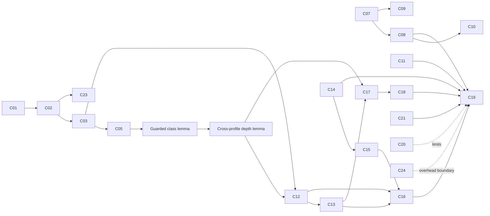

# ICHAN-DH Proof and Evidence Ledger

Gate 2 artifact status: **researcher accepted on 2026-09-06; operative B1 reconciliation recorded**  
Normative specification: [`mathematical_specification.md`](mathematical_specification.md)  
Approved synchronization decision: [`plans/2026-09-04-gate2-guarded-synchronization-design.md`](plans/2026-09-04-gate2-guarded-synchronization-design.md)

Status values: `not started`, `drafted`, `researcher verified`, `experiment verified`, `rejected`, or `revised`.

Passing an example is implementation evidence, not a mathematical proof. A proof applies to its stated abstract model; traceability connects that model to code.

## Operative B1 proof mapping

The first B1 section of the mathematical specification is controlling. C01–C24 below preserve the earlier claim identifiers and review history; fixed-prefix and unresolved-padding wording in that historical table is superseded by this mapping. Gate acceptance is not a record of per-claim researcher verification or executed evidence. B1-P1–P7 received manual Scientist/Software Engineer review; no machine-checked proof or test result is asserted.

| Current proof/contract | Earlier claims affected | Operative conclusion | Later user-run obligation |
|---|---|---|---|
| B1.1–B1.3; III-A/B | C01–C06, C21 | Finite stored-value model; explicit CT interface and validated immutable padding state | Domain/padding/CT fixture acceptance and rejection grid |
| B1.8; III-D | C07–C11 | 17-byte header and exact framing; 136 carriers, not a fixed spatial prefix; frozen body CRC semantics | Empty/ASCII CRC vectors, field offsets, malformed fields, byte order |
| B1-P1 | C07, C09, C17 | Reconstruct identical ordered J and beta under the intact channel | Skipped carriers, beta greater than 136, insufficient carriers, beta=N |
| B1-P2 | C14–C15, C21–C22 | Preserve padding membership everywhere and stratum membership in the body | Padding interval edges, threshold edges, signed extrema |
| B1-P3 | C12–C13, C17 | Preserve every profile's guarded depth after full or partial body writes | All selected/recomputed profile pairs and actual chunk widths |
| B1-P4 | C12–C13, C17 | Raw slots invariant; usable bytes are floor(raw/8); minimal feasible profile is reconstructed | Raw slots 7/8/9, equal capacities, empty payload, exact fit, one-byte overflow |
| B1-P5 | C14–C19 | Exact payload recovery in the intact abstract array model, not cover recovery | Endpoint, trailing cover, zero-depth advance, resource-safe length validation |
| B1-P6; III-F | C19, C21–C22 | Conditional DICOM corollary; derived metadata and failure-atomic publication obligations | Same stored values/receiver metadata after save; output-policy failure fixtures |
| B1-P7 | C20, C24 | No-padding reduction; non-injective cover replacement; fixed-profile prefix cost distinct from header bits | Two-cover collision, variable beta, raw/byte/tail and map cost accounting |
| Historical C23 with B1 domain | C23 | Declared-range metric definitions remain applicable, without security/clinical interpretation | Controlled metric arrays; no empirical result yet |

These obligations form the documentation-level `ICHAN-TV1.1` extension; executable test cases and recorded outcomes remain Gates 4–5. The historical dependency diagram below is not the complete B1 dependency graph: the operative chain is P1/P2 → P3 → P4 → P5 → conditional P6, with P7 recording limits/cost. P1 and P2 also feed P5 directly through header/range correctness.

Gate 4 source traceability is recorded in [the implementation handoff](gate4_implementation_handoff.md). New source files do not change any claim's execution-evidence status: no Python/import/notebook/test was run. Gate 3 researcher approval is recorded in [current progress](gate_progress.md).

## Historical C01–C24 claim ledger

| ID | Process | Intended internal-correctness claim | Evidence obligation | Planned canonical owner | Notebook evidence | Current status | Residual boundary |
|---|---|---|---|---|---|---|---|
| C01 | Input validation | Accepted arrays belong to the declared finite 2-D integer domain | Preconditions plus rejection cases | `core.py` | Algorithm notebook | drafted | DICOM interface validity is separately bounded by C21 |
| C02 | Native domain | Domain limits, cardinality, and span match `BitsStored` and signedness | Algebraic derivation | `core.py` | Algorithm notebook | drafted | Version 1 is deliberately restricted to 2-16 stored bits |
| C03 | Step 1 classification | Every valid pixel receives exactly one label | Partition proof | `core.py` | Boundary assertions | drafted | A class may be empty at small bit depths |
| C04 | Eight-bit reduction | Native rule reproduces cutoffs 100 and 150 for unsigned 8-bit pixels | Direct substitution | `core.py` | 8-bit boundary vector | drafted | Reproduces thresholds, not logistic predictions in every fitted sample |
| C05 | Monotonic labels | Increasing stored intensity cannot decrease the label | Ordered-interval proof | `core.py` | Ordered-vector assertion | drafted | No clinical meaning follows |
| C06 | Redundant model | Direct rule has zero disagreement with labels generated by itself | Empirical-risk identity | `baseline.py`, `core.py` | Baseline comparison | drafted | Does not establish equality to arbitrary trained-model output |
| C07 | Step 2 size | A framed payload of `L` bytes occupies `L + 17` bytes and its fixed header needs 136 prefix pixels | Field-width sum | `core.py` | Frame-size assertions | drafted | A header-layout change reopens Gate 2 |
| C08 | Step 2 round trip | Valid `unframe(frame(P))` returns `P` | Construction/parser proof | `core.py` | Empty and non-empty vectors | drafted | Assumes intact complete frame bytes |
| C09 | Frame boundary | The fixed prefix establishes frame start and a valid header identifies one logical payload endpoint | Fixed-width parsing proof | `core.py` | Header inspection | drafted | Assumes the version-1 row-major prefix convention |
| C10 | Malformed frames | Explicit invalid conditions reject before payload return | Branch proof plus examples | `core.py` | Failure matrix | drafted | CRC collisions and deliberate recomputation remain possible |
| C11 | Byte-to-bit conversion | MSB-first packing and unpacking preserve every complete byte sequence | Bit-index bijection proof | `core.py` | Boundary and seeded vectors | drafted | Partial-byte input to the inverse is rejected |
| C12 | Guarded capacity | Maximum writable body bits equal the sum of deterministic guarded depths after the fixed prefix | Finite-sum achievability and upper-bound proof | `core.py` | Exhaustive small arrays | drafted | Guard bands may reduce capacity near thresholds |
| C13 | Profile selection | Guarded capacities are ordered and exactly one minimal feasible profile is selected | Candidate-set inclusion and finite-order minimality | `core.py` | Boundary payload sizes | drafted | Uses frozen profiles `(1,0,0)`, `(2,1,0)`, `(3,2,1)` |
| C14 | Rank-code LSB replacement | Replaced low-order bits equal the requested chunk and agree with supported signed stored LSBs | Quotient/remainder algebra plus signed congruence lemma | `core.py` | Exhaustive small-value checks | revised | Does not prove cover recovery |
| C15 | Pixel range | Header and guarded body replacement preserve the declared integer range | Aligned-block bound proof | `core.py` | Domain-boundary examples | drafted | Implementation must avoid negative-integer bitwise ambiguity |
| C16 | Traversal termination | Embedding consumes all and only payload-body bits when guarded capacity is sufficient | Loop invariant and lexicographic variant | `core.py` | Exact and partial-final-chunk cases | drafted | Requires frozen row-major traversal |
| C17 | Extraction alignment | Receiver reconstructs profile, positions, and depths from the stego array without an external map | Guarded class and cross-profile capacity invariants | `core.py` | Cross-profile round-trip grid | drafted | Assumes intact stored values and matching DICOM metadata |
| C18 | Extraction stopping | Receiver reads exactly `8L` body bits and ignores trailing cover capacity | Fixed-header length and aligned-state proof | `core.py` | Trailing-capacity cases | drafted | Corrupted plausible lengths rely on rejection/CRC behavior |
| C19 | End-to-end payload | Extracting an intact valid embedding returns the original payload | Composition of C08, C11, C14, and C16-C18 | `core.py` | Matched round-trip matrix | drafted | Not cryptographic security, robustness, or cover recovery |
| C20 | Cover recovery | Original cover is not recoverable from replacement LSBs without extra state | Explicit two-cover collision | `core.py` | Two-cover collision example | drafted | A future reversible construction would replace this negative claim |
| C21 | DICOM load boundary | Accepted DICOM objects produce arrays satisfying the abstract stored-value model | Interface-contract implication and rejection branches | `dicom_io.py` | Synthetic metadata fixtures plus selected examples | revised | Padding attributes are unresolved pending B0/B1; not full DICOM IOD conformance |
| C22 | Derived DICOM output | Output obtains new instance identity, records derivation, preserves truthful padding semantics, and does not retain known-stale signatures | Standards-grounded engineering contract | `dicom_io.py` | Metadata inspection | revised | Cannot be closed until B0/B1 is selected; requires Gate 4 standards/serialization review |
| C23 | Metric range | MSE, PSNR, and SSIM use the declared native span `2^b-1` | Definition-to-code traceability | `metrics.py` | 8/12/16-bit controlled arrays | drafted | These metrics do not establish security or diagnostic safety |
| C24 | Side-information overhead | A direct four-symbol map over V positions costs 2V bits and every injective all-map representation has worst-case length at least 2V; ICHAN-DH embeds a header bootstrap | Counting argument and protocol accounting | `metrics.py` | Overhead table | revised | B1 may make the reserved bootstrap span variable; future keys, nonces, tags, or maps must be counted |

## Claim categories that require experiments

| ID | Proposed empirical claim | Required design | Status |
|---|---|---|---|
| E01 | ICHAN-DH improves exact extraction over the paper-faithful baseline | Matched covers and payloads; disclosed reproduction interpretations | not started |
| E02 | Quality changes as payload bpp increases | Repeated patient-level payload sweep | not started |
| E03 | Native bit depth changes capacity or distortion behaviour | Stratified 8/12/16-bit analysis | not started |
| E04 | Results generalise beyond the development collection | Patient-separated external dataset | not started |
| E05 | Method resists steganalysis | Cover/stego detector protocol with patient/source separation | not started |
| E06 | Diagnostic content is preserved | ROI/task-based or reader study | not started |

E05 and E06 are outside the current logic-first contribution unless their protocols are later implemented and approved.

## Proof dependency order

## Researcher verification fields

For each reviewed claim, add:

- reviewer name or identifier;
- review date;
- accepted assumptions;
- observed notebook cell or artifact;
- pass/fail/revision decision;
- defect description when applicable;
- link to the updated equation, pseudocode, code, or result.
