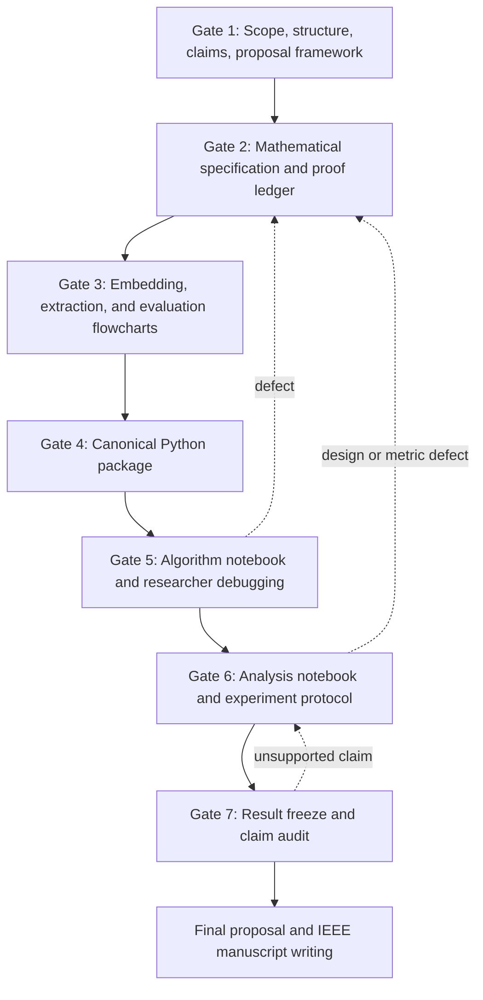

# ICHAN-Secure Research Workflow

## Current status

- Gate 1: **accepted**.
- Gate 2: **researcher accepted on 2026-09-06**; the operative B1 contract and proof chain precede the explicitly historical candidate in the mathematical specification.
- Gate 3: **researcher accepted** in the conversation; the later resume request authorizes Gate 4. The prior pause is over.
- Gate 4: **researcher accepted for progression in the conversation; recorded on 2026-09-10**, limited to the approved B1/CT method and disclosed reproduction. Acceptance does not establish importability or runtime correctness. See the [implementation handoff](gate4_implementation_handoff.md).
- Gate 5: **initial bounded notebook written; review/debugging pending; not accepted**. The Colab algorithm notebook imports the canonical package and uses controlled synthetic fixtures. See the [run and read guide](gate5_colab_run_guide.md) and [coverage handoff](gate5_notebook_handoff.md). Advanced file-interface obligations remain pending. No Python, installation, import, test, or notebook execution is performed by the assistant.
- Gates 6-7: **not started**. The historical mixed notebook remains legacy prework, not the Gate 5 entry point.

See [`gate_progress.md`](gate_progress.md) for the evidence-based progress and comparison with BASMEDSecure.

## Interaction contract

Seven planned researcher approvals are required. The assistant may provide progress updates within a gate; the researcher only needs to respond when a message contains an explicit gate decision.

Use one of these responses:

- `APPROVE GATE X` — accept the artifacts and continue.
- `REVISE GATE X: ...` — request a concrete correction.
- `PAUSE` — stop before further file changes.

Debugging can add extra exchanges because failed assertions or unexpected datasets must be resolved rather than ignored.

## End-to-end process

## Gate acceptance table

| Gate | Required artifacts | Researcher checks | Stop condition |
|---|---|---|---|
| 1 | Approved design, proposal skeleton, claim matrix, proof ledger skeleton, artifact ownership | Scope and planned deliverables match the intended paper | No mathematical or implementation work before approval |
| 2 | Complete formulas, pseudocode, assumptions, propositions, proofs, counterexamples, complexity | Every internal-correctness claim is understandable and bounded | No flowchart or code when an invariant is unresolved |
| 3 | Separate embedding, extraction, and evaluation flowcharts | Every branch maps to a precondition, decision, state change, or rejection | No implementation when sender/receiver state is ambiguous |
| 4 | Importable canonical package | Functions match the approved specification and do not duplicate notebook logic | No experimental notebook until interfaces are frozen |
| 5 | Algorithm notebook | Researcher runs cells, records failures, and confirms proof-related examples | No dataset experiment until controlled examples pass |
| 6 | Analysis notebook, manifest schema, comparison protocol | Same covers/payloads, patient-level separation, correct metrics and plots | No final claims until planned experiments are complete |
| 7 | Frozen result tables, figure index, claim-evidence audit, limitations | Every manuscript claim points to verified evidence | Writing begins only after approval |

## Change control

If debugging changes an equation, frame field, traversal rule, or extraction state, return to Gate 2 and update the proof ledger before changing downstream artifacts. If only implementation syntax changes without changing behaviour, update Gate 4 and repeat the affected Gate 5 checks.

## Verification boundary

The assistant will prepare code and verification cells but will not execute notebook or Python implementation code unless the researcher explicitly changes the earlier restriction. Static JSON, file-structure, identifier, and documentation checks remain permitted.
